# 오토다타 사용 설명서

현장 조사표를 엑셀 데이터로 바꾸는 프로그램 오토다타(AutoData)를 처음 쓰는 분을 위한 설명서입니다. 설치부터 양식 템플릿 만들기, 휴대전화로 현장에서 바로 입력하기, 작성된 조사표 파일 한꺼번에 읽기, 엑셀·조사표 PDF 만들기, 문제 해결까지 순서대로 안내합니다.

## 1. 처음 읽는 분께 {#start}

**2장(설치)**과 **3장(따라 해 보기)**만 먼저 읽으면 예제 조사표로 템플릿 만들기부터 엑셀 저장까지 10분 안에 해 볼 수 있습니다. 현장에서 휴대전화로 입력하려면 **5장**, 이미 작성된 조사표 파일이 쌓여 있다면 **6장**을 이어서 읽으세요. 나머지는 필요할 때 찾아 읽으면 됩니다.

| 하고 싶은 일 | 볼 곳 |
|---|---|
| 프로그램을 받아서 실행하기 | 2장 |
| 예제로 사용법 익히기 | 3장 |
| 우리 조사표 양식으로 템플릿(추출 칸) 만들기 | 4장 |
| 현장에서 휴대전화로 입력해 실시간으로 모으기 — 공유 링크·QR | 5장 |
| 작성된 조사표 파일(hwpx·hwp·pdf·스캔)들을 한꺼번에 엑셀로 | 6장 |
| 양식을 모르는 파일을 AI 로 읽기, 결과 해석 | 7장 |
| AI 키·글자 인식 기능·SCE 연계·교정 사전 설정 | 8장 |
| 이 컴퓨터에서 되는 것·안 되는 것 확인 | 9장 |
| 오류나 이상한 결과 해결하기 | 10장 |
| 파일이 어디에 저장되는지, 박스 유형별 엑셀 값 규칙, 단축키 | 11장 |

### 오토다타가 하는 일

종이·한글·PDF 로 된 **현장 조사표**를 넣으면 표 안의 값을 읽어 **엑셀 데이터**로 정리합니다. 손으로 옮겨 적던 일을 대신하며, 조사표 한 장이 엑셀 한 행(표가 든 조사표는 줄마다 한 행)이 됩니다.

| 단계 | 하는 일 | 결과 |
|---|---|---|
| 템플릿 디자이너 | 양식 파일 하나를 올리면 표 칸마다 읽을 자리(박스)를 자동으로 잡습니다. 확인·수정해 템플릿으로 저장합니다 | 템플릿(양식 이름 + 박스 목록 + 양식 PDF) |
| 데이터 입력 관리 | 템플릿을 휴대전화용 디지털 입력 양식으로 바꿔 공유 링크·QR 로 나눠 줍니다. 현장에서 보낸 기록이 실시간으로 모입니다 | 엑셀, 기록마다 채워진 현장조사표 PDF |
| 데이터 추출 관리 | 이미 작성된 조사표 파일들을 한꺼번에 올리면 어느 양식인지 알아보고 값을 읽습니다. 설문지는 템플릿 없이 인식합니다 | 양식별 시트 엑셀(이상치 표시), 보고서 양식에 채운 엑셀 |
| AI 데이터 추출·분석 | 템플릿이 없는 처음 보는 양식도 AI 가 읽어 표로 만들고, 결과를 요약·해석합니다(AI 키 필요) | 엑셀, 누적 DB, 해석 글 |

### 무엇이 어디에서 처리되나

| 기능 | 처리하는 곳 | 인터넷으로 나가는 것 |
|---|---|---|
| 템플릿 디자이너 · 데이터 추출 관리(추출·엑셀·보고서) | 이 컴퓨터 안 | 없음 |
| 스캔 문서 글자 인식(OCR) | 이 컴퓨터 안 | 없음(경량판은 처음 한 번 기능을 공개 저장소에서 받음) |
| 데이터 입력 관리(디지털 양식) | 현장 기록은 오토다타 웹(클라우드플레어)에 모였다가 이 컴퓨터로 내려옴 | 양식 정의와 현장 기록·사진. 링크(입력 키)를 아는 사람만 보낼 수 있고, 가져오는 관리 키는 이 컴퓨터에만 있음 |
| AI 자동 이해 · AI 데이터 추출·분석 · AI 초안 · AI 결과 해석 | 선택한 AI 회사(Claude·ChatGPT·Gemini) | 그때 넣은 파일의 내용(켜지 않으면 없음) |

프로그램은 이 컴퓨터에서 도는 **오토다타 도우미**(`FieldSurveyDB.exe`)와 그 화면을 여는 **브라우저**로 되어 있습니다. 화면은 브라우저에 보이지만 파일은 이 컴퓨터를 떠나지 않습니다.

### 화면 구성

도우미를 켜면 브라우저에 **시작 화면**이 열립니다. 여섯 개 메뉴가 일하는 순서대로 놓여 있고, 어느 화면에서든 위쪽 탭으로 오갈 수 있습니다.

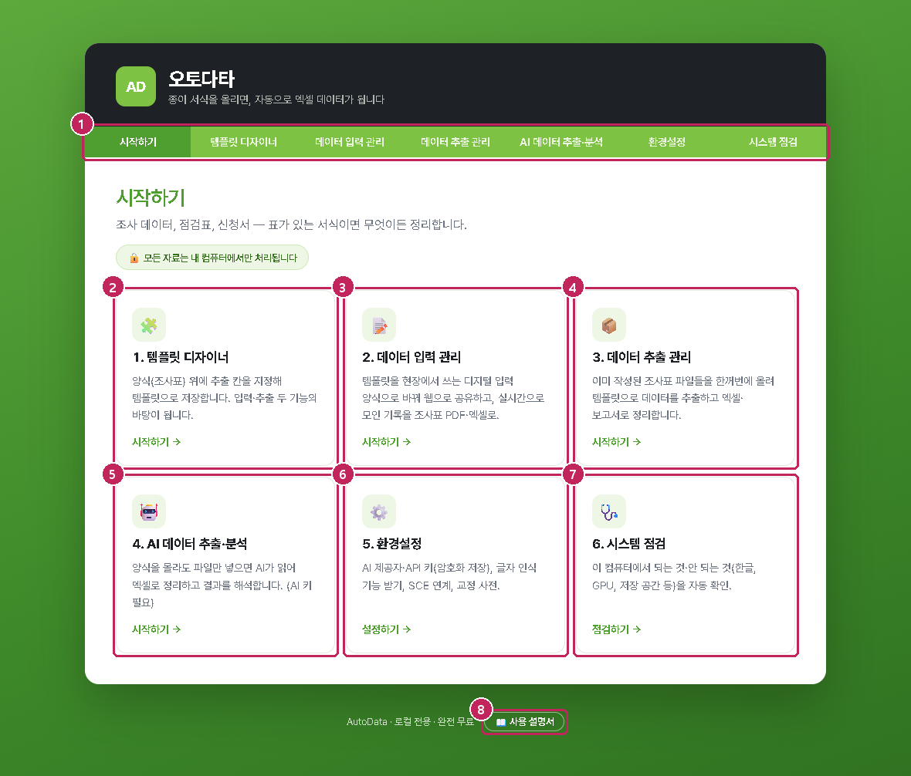

{{1}} 위쪽 탭 — 지금 어느 화면인지 보여 줍니다. 작업 화면에서는 이 자리의 탭을 눌러 이동합니다
{{2}} 1. 템플릿 디자이너 — 양식에 박스를 지정해 템플릿으로 저장(4장). 입력·추출 두 기능의 바탕
{{3}} 2. 데이터 입력 관리 — 템플릿을 휴대전화 디지털 양식으로 공유하고 실시간 기록을 모음(5장)
{{4}} 3. 데이터 추출 관리 — 작성된 조사표 파일들을 한꺼번에 엑셀로(6장)
{{5}} 4. AI 데이터 추출·분석 — 양식을 몰라도 AI 가 읽어 정리(7장, AI 키 필요)
{{6}} 5. 환경설정 — AI 키·글자 인식 기능·SCE 연계·교정 사전(8장)
{{7}} 6. 시스템 점검 — 이 컴퓨터에서 되는 것·안 되는 것(9장)
{{8}} 사용 설명서 — 이 설명서를 새 창에 엽니다(작업 화면 탭 오른쪽 끝의 [[📖 설명서]]도 같음)

| 메뉴 | 이럴 때 씁니다 |
|---|---|
| [[템플릿 디자이너]] | 처음 한 번, 우리 조사표 양식마다 읽을 자리를 정해 템플릿으로 저장할 때 |
| [[데이터 입력 관리]] | 앞으로의 조사를 종이 대신 휴대전화로 입력해 바로 모으고 싶을 때 |
| [[데이터 추출 관리]] | 이미 작성된 조사표 파일(한글·PDF·스캔)이 많이 쌓여 있을 때, 설문지를 집계할 때 |
| [[AI 데이터 추출·분석]] | 양식이 제각각이라 템플릿을 만들기 어렵거나, 결과를 글로 요약하고 싶을 때 |
| [[환경설정]] · [[시스템 점검]] | AI 키를 넣거나 글자 인식 기능을 받을 때, 새 컴퓨터에 처음 설치했을 때 |

## 2. 설치와 실행 {#install}

설치 프로그램이 없습니다. 압축 파일을 풀고 실행 파일을 두 번 누르면 됩니다. 파이썬 등 필요한 것은 모두 폴더 안에 들어 있고, 관리자 권한도 필요 없습니다.

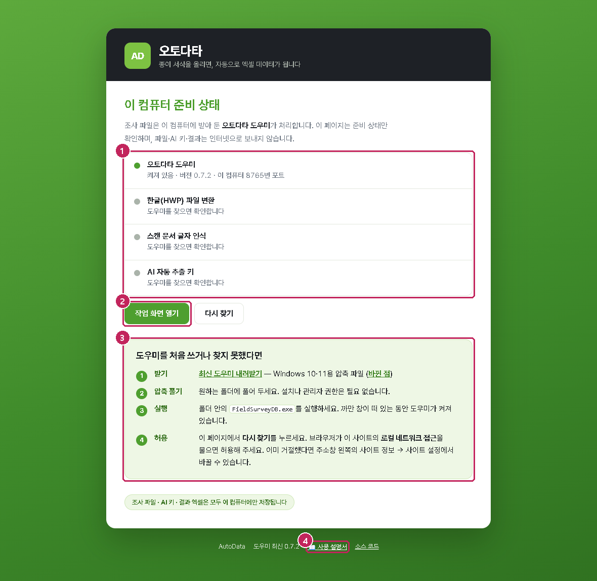

{{1}} 이 컴퓨터의 준비 상태 — 도우미가 켜져 있는지, 한글 변환·글자 인식·AI 키가 준비됐는지
{{2}} 작업 화면 열기 — 도우미를 찾으면 켜집니다
{{3}} 도우미를 처음 쓰거나 못 찾았을 때 — 내려받기와 실행 순서
{{4}} 사용 설명서(이 문서)

1. **받기** — 웹 시작 페이지 `https://autodata.singlena.workers.dev` 에서 **최신 도우미 내려받기**를 누릅니다. `AutoData_Windows.zip`(약 140MB)이 받아집니다.
2. **풀기** — 압축을 **쓰기 가능한 폴더**에 풉니다. 예: `C:\AutoData\` 또는 `문서\AutoData\`. `C:\Program Files\` 나 네트워크 드라이브에는 넣지 마세요(작업 폴더를 만들지 못합니다). USB 로 다른 컴퓨터에 옮겨도 됩니다.
3. **실행** — 폴더 안의 `FieldSurveyDB.exe` 를 두 번 누릅니다. "Windows의 PC 보호" 창이 뜨면 **추가 정보 → 실행**을 누르세요. 첫 실행은 백신 검사 때문에 1~2분 걸릴 수 있습니다.
4. 까만 창에 `[성능]`·`[점검]` 줄이 뜨고 잠시 뒤 브라우저에 시작 화면이 열리면 됩니다. **까만 창은 그대로 두세요** — 닫으면 프로그램이 꺼집니다.
5. **끝내기** — 까만 창에서 Ctrl+C 를 누르거나 창을 닫습니다. 브라우저 탭만 닫아도 도우미는 켜져 있으니, 브라우저에서 `http://127.0.0.1:8765` 를 열면 다시 화면이 나옵니다.

> **알아두기** 처음 설치한 컴퓨터에서는 시작 화면의 **6. 시스템 점검**을 한 번 눌러 보세요. 한글(HWP) 유무, 글자 인식 기능, 작업 폴더 쓰기 등을 항목별로 확인하고 해결 방법을 알려 줍니다(9장).

### 2.1 배포본 고르기

| 배포본 | 파일 | 언제 |
|---|---|---|
| **경량판**(기본) | `AutoData_Windows.zip` 약 140MB | 인터넷이 되는 업무용 컴퓨터. 스캔 문서를 처음 쓸 때 글자 인식 기능(약 270MB)을 받습니다 |
| **오프라인판** | `AutoData_Windows_offline.zip` 약 430MB | 인터넷이 안 되거나 공개 저장소 주소가 막힌 컴퓨터. 글자 인식 기능이 들어 있습니다 |
| **GPU판** | 별도 전달(약 2.2GB) | 인터넷 없이 NVIDIA 그래픽카드로 빠르게 글자를 인식해야 할 때 |

세 배포본의 기능은 같습니다. 스캔 문서 글자 인식을 준비하는 방식과 속도만 다릅니다.

### 2.2 한글(HWP)이 필요한가요

- **hwpx·hwp 파일**을 올릴 때만 이 컴퓨터에 설치된 한글로 PDF 로 바꿔 읽습니다. 한글이 없으면 그 파일만 못 씁니다.
- **PDF 파일**은 한글 없이 바로 읽습니다. 한글 파일을 한글에서 **PDF로 저장**한 뒤 올려도 결과는 같습니다.
- 변환이 오래 걸리거나 멈추면 한글의 자동화 **보안 승인** 창이 뒤에 숨어 있는 경우입니다. 그 창을 승인하거나, 위처럼 PDF 로 저장해 올리세요.

### 2.3 새 버전

웹 시작 페이지는 켜져 있는 도우미의 버전을 보고 새 버전이 있으면 안내합니다. 새 zip 을 풀어 **예전 폴더의 `data` 폴더를 새 폴더로 옮기면** 템플릿·양식·결과가 그대로 이어집니다. 글자 인식 기능은 사용자 폴더에 따로 받아 두므로 다시 받지 않습니다.

## 3. 10분 만에 따라 해 보기 {#tour}

프로그램 폴더의 **예제** 폴더(`예제\`)에 가상의 조사표가 들어 있습니다. 장소·이름·수치는 모두 지어낸 것입니다.

| 파일 | 내용 |
|---|---|
| `야생조류_현장조사표_빈양식.pdf` | 빈 양식 — 템플릿 디자이너에 올리는 기준 양식 |
| `작성예시_01.pdf` ~ `작성예시_03.pdf` | 같은 양식에 기록을 채운 조사표 3장 — 데이터 추출 관리에 올리는 파일 |
| `현장사진_예제.jpg` | 작성예시에 든 사진 |

### 3.1 템플릿 만들기 (2분)

1. 시작 화면에서 **1. 템플릿 디자이너**를 누릅니다.
2. **양식 파일 놓기** 상자에 `야생조류_현장조사표_빈양식.pdf` 를 끌어다 놓거나 눌러서 고릅니다.
3. 양식이 화면에 보이고 표 칸마다 초록 박스가 자동으로 생깁니다. 오른쪽 **추출 항목** 목록에서 이름을 확인합니다. `조사 방법`의 도보·차량·선박은 ☑ 체크 유형, `관찰 기록`은 ▤ 표(여러 행) 유형, `현장 사진`은 🖼 이미지 유형으로 잡혀 있어야 합니다. 다르면 항목 오른쪽의 유형을 바꿉니다(4.3절).
4. 오른쪽 아래 **템플릿 이름**에 `야생조류 현장 조사표`라고 적고 **템플릿 저장**을 누릅니다.

### 3.2 작성된 조사표 3장을 엑셀로 (3분)

1. 위쪽 탭의 **데이터 추출 관리**를 누릅니다. 1번에 방금 저장한 템플릿이 보입니다.
2. 2번 **파일 선택**에서 `작성예시_01.pdf`, `02`, `03` 세 파일을 한꺼번에 고르고 **추출 + 엑셀 만들기**를 누릅니다.
3. 몇 초 뒤 "9행 처리 · 시트 1개로 정리"가 나옵니다. 조사표 3장인데 9행인 것은 관찰 기록 표의 줄마다 한 행이 되기 때문입니다. **📥 엑셀 다운로드**로 받아 열어 보세요. 사진 칸은 그림으로, 개체수는 숫자로 들어 있습니다.
4. 이상치 2건은 시작 시각 `13:00` 처럼 다른 기록과 동떨어진 값에 붙은 확인 표시입니다(주황 칸). 실제 값이 맞으면 그대로 두면 됩니다.

### 3.3 휴대전화로 입력해 보기 (5분, 인터넷 필요)

1. 위쪽 탭의 **데이터 입력 관리**를 누릅니다. 1번에서 템플릿 `야생조류 현장 조사표`를 고르고 **📲 양식 만들기 · 공유 링크 받기**를 누릅니다.
2. 2번에 공유 링크와 QR 이 나옵니다. 휴대전화 카메라로 QR 을 찍어 열거나, **복사**한 링크를 메신저로 보내세요. 지금은 시험이니 **↗ 열어 보기**로 이 컴퓨터에서 열어도 됩니다.
3. 열린 입력 화면에 값을 몇 개 적고 **기록 보내기**를 누릅니다.
4. 데이터 입력 관리의 3번 **실시간 기록** 표에 몇 초 안에 그 기록이 나타납니다. 4번의 **엑셀 내려받기**와 **현장조사표 PDF 내려받기**를 눌러 보세요. PDF 는 빈 양식에 방금 적은 값이 채워진 조사표입니다.
5. 다 해 봤으면 2번의 **✕ 양식 삭제**로 시험 양식을 지웁니다(웹에 모인 기록도 함께 지워집니다).

## 4. 템플릿 디자이너 — 양식에 읽을 자리 정하기 {#designer}

템플릿은 "이 양식의 어느 칸을 어떤 이름·유형으로 읽을지"를 정한 것입니다. 양식 하나에 한 번만 만들면 데이터 입력 관리와 데이터 추출 관리가 함께 씁니다. 양식 PDF 가 템플릿과 함께 저장되어, 다음에 불러오면 양식이 그대로 보입니다.

### 4.1 양식 불러오기

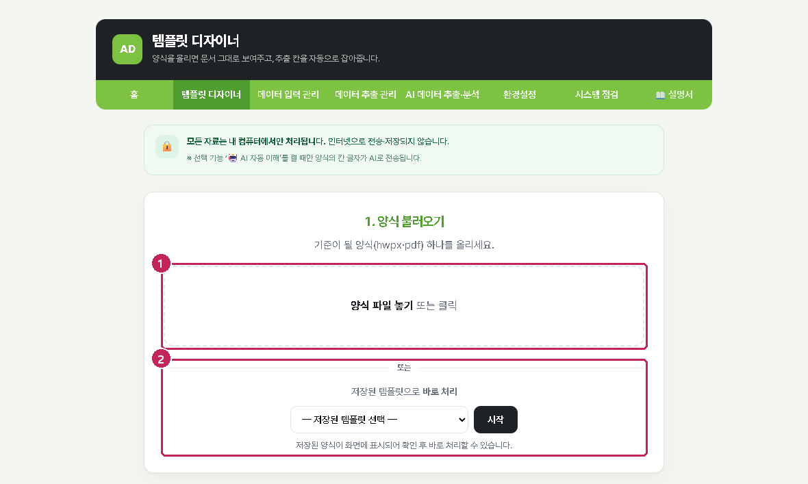

{{1}} 양식 파일 놓기 — 기준이 될 양식 하나(hwpx·hwp·pdf)를 끌어다 놓거나 눌러서 고릅니다
{{2}} 저장된 템플릿으로 바로 처리 — 이미 만든 템플릿을 골라 **시작**을 누르면 양식과 박스가 그대로 열립니다

- 기준 양식은 **빈 양식**이 가장 좋습니다. 작성된 조사표를 올려도 되지만, 그 값이 인쇄된 채로 양식 PDF 가 저장되어 현장조사표 PDF(5.6절)에 남을 수 있습니다.
- 스캔한 양식(글자가 없는 그림 PDF)도 됩니다. 칸 선을 그림에서 찾아 박스를 잡고, 경량판은 처음에 글자 인식 기능을 받으라고 안내합니다(8.4절).
- 표 없이 `1. 2. 3.` 문항 번호로 된 **설문지**를 올리면 "설문지로 인식됨"이 뜹니다. 설문지는 템플릿 없이 데이터 추출 관리가 자동 인식하므로 저장하지 않아도 됩니다(6.6절).

### 4.2 박스 확인·정리

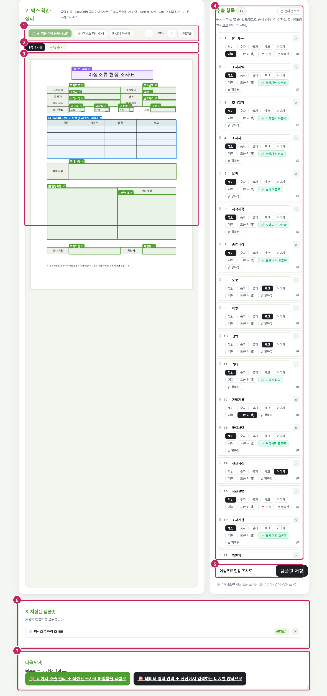

{{1}} 도구 — 🤖 AI 자동 이해(선택), ✨ 칸 박스 다시 생성, 🗑 전체 지우기, 확대·축소·너비맞춤
{{2}} 쪽 이동 — 여러 쪽 양식은 쪽마다 박스가 있습니다. ✕ 로 필요 없는 쪽을 빼고 **＋쪽 추가**로 다른 파일의 쪽을 붙입니다
{{3}} 양식 위의 박스 — 초록 상자가 읽을 자리입니다. 끌어서 옮기고, 모서리로 크기를 바꾸고, 빈 곳을 끌어 새로 그립니다. 파란 상자는 표(여러 행), 보라 상자는 제목입니다
{{4}} 추출 항목 목록 — 순서가 엑셀 열 순서입니다. 이름을 고치고, 유형 단추로 유형을 바꾸고, 끌어서 순서를 바꿉니다
{{5}} 템플릿 이름·저장
{{6}} 저장된 템플릿 — 불러오기·삭제
{{7}} 다음 단계 — 데이터 추출 관리 또는 데이터 입력 관리로 바로 이동

화면의 박스를 누르면 오른쪽 목록이 그 항목으로 이동해 잠깐 깜빡이고, 목록의 항목을 누르면 화면도 그 박스로 이동합니다. 박스 이름은 엑셀의 열 이름이 되니 알아보기 쉽게 고치세요.

### 4.3 박스 유형

| 유형 | 표시 | 읽는 방법 | 휴대전화 입력 화면(5장) |
|---|---|---|---|
| 일반 | (없음) | 칸 안의 글자를 그대로 | 글 상자 |
| 숫자 | # | 단위·한글을 걷어내고 수로(예: `약 25.5 m` → 25.5). 엑셀에 수로 들어가 합계·평균이 됩니다. 값 일부만 숫자면(`좌안 12 우안 15`) 글자 그대로 | 숫자 상자 |
| 굵게 | 𝐁 | 굵은 글씨만 | 글 상자 |
| 체크 | ☑ | 칸 안에 √·✓·V·○ 표시가 있으면 그 칸의 글(예: `도보`), 없으면 빈 값 | 체크 상자 |
| 이미지 | 🖼 | 칸 안의 그림(사진)을 잘라 엑셀에 그림으로 | 사진 찍기·고르기 |
| 제목 | 📑 | 쪽 위의 큰 글씨(양식 이름). 데이터 추출 관리가 양식을 알아보는 기준이고 "제목별 분류"의 시트 이름이 됩니다 | 쪽 머리글로만 보임 |
| 표(여러 행) | ▤ | 머리글 한 줄 아래 데이터가 여러 줄 이어지는 표. 줄마다 엑셀 한 행이 되고 열 이름은 표 머리글 | 줄을 추가하며 입력하는 표 |

- 이름이 길이·높이·개체수·(m) 처럼 수치를 뜻하면 **숫자**로 자동 지정됩니다. 번호·일자·좌표는 계산 대상이 아니라 일반으로 둡니다.
- 머리글 한 줄 아래 데이터가 여러 줄인 표(담당자 명단, 측정값 목록, 관찰 기록)는 **표(여러 행)** 박스 하나로 자동 인식됩니다(파란색). 직접 그린 박스도 목록에서 이 유형을 고르면 같은 방식으로 처리됩니다.
- 세로로 합쳐진 칸(여러 행에 걸친 칸)의 값은 걸친 행마다 같은 값이 들어갑니다. 담당자가 두 줄로 적힌 칸은 `김철수, 이영희` 처럼 쉼표로 한 값이 됩니다.
- 상단 큰 글씨는 **제목** 박스로 자동 인식됩니다. 제목이 없는 양식은 데이터 추출 관리에서 **기준 템플릿**을 고르면 됩니다(6.2절).

### 4.4 라벨 기준과 위치 기준

박스는 두 가지 방식으로 값을 찾습니다.

- **라벨 기준** — 박스 옆의 라벨 칸(예: `조사지역`)을 찾아 그 옆(또는 아래) 칸을 읽습니다. 조사표에 줄이 추가되거나 표가 밀려도 값이 맞습니다. 자동 생성된 박스는 대부분 라벨 기준입니다.
- **위치 기준** — 저장된 좌표 그대로 읽습니다. 라벨이 없는 칸(사진, 표, 체크 등)에 씁니다.

목록에서 항목을 누르면 라벨(앵커)과 기준을 볼 수 있습니다. 라벨이 박스 자리와 맞지 않는 것으로 확인된 항목은 자동으로 위치 기준으로 읽습니다.

### 4.5 여러 박스 한꺼번에

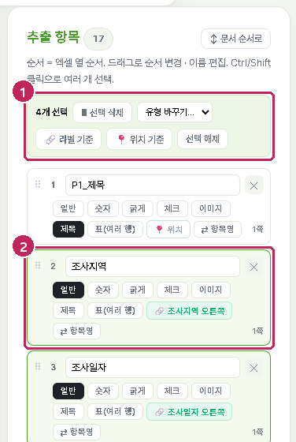

{{1}} 선택 막대 — 고른 개수와 한꺼번에 할 일: 삭제, 유형 바꾸기, 라벨/위치 기준 전환, 선택 해제
{{2}} 고른 항목 — 목록과 화면의 박스가 함께 강조됩니다

| 하고 싶은 일 | 방법 |
|---|---|
| 하나씩 더하거나 빼기 | Ctrl + 클릭 (화면·목록 모두) |
| 범위로 고르기 | Shift + 클릭 |
| 영역으로 고르기 | 빈 곳에서 Shift + 끌기 |
| 이 쪽 전체 | Ctrl + A |
| 고른 박스 한꺼번에 옮기기 | 고른 박스 중 하나를 끌기 |
| 삭제 · 되돌리기 | Delete · Ctrl + Z (삭제·한꺼번에 바꾸기·이동을 되돌림) |

### 4.6 저장과 불러오기

- **템플릿 저장**을 누르면 박스와 지금 열린 양식 PDF 가 함께 저장됩니다. 같은 이름이면 덮어씁니다.
- 같은 양식을 고쳐 가며 **다른 이름**으로 여러 번 저장하면 저장할 때 알려 줍니다. 데이터 추출 관리는 화면에 불러온 템플릿 → 가장 최근 저장본 순으로 쓰지만, 예전 것은 목록에서 ✕ 로 지우는 것이 안전합니다.
- 저장된 템플릿 목록의 **불러오기**를 누르면 양식과 박스가 화면에 열리고 위쪽에 안내가 붙습니다. 박스만 고치고 다시 저장하면 되고, **← 처음으로**로 다른 양식을 올릴 수 있습니다.
- 이미 만든 디지털 양식(5장)은 만들 때의 박스를 그대로 씁니다. 템플릿을 고친 뒤에는 양식을 새로 만드세요.

### 4.7 AI 자동 이해(선택)

도구의 **🤖 AI 자동 이해**를 누르면 AI 가 양식을 읽고 "이 칸은 하천명, 이 칸은 보 길이"처럼 항목 이름을 붙여 줍니다. 박스 이름을 일일이 고치는 수고를 줄여 줍니다. 환경설정에 AI 키가 있어야 하며, 누를 때만 양식 한 건의 칸 글자가 AI 로 전송됩니다. AI 가 붙인 이름은 목록에서 확인·수정할 수 있습니다.

## 5. 데이터 입력 관리 — 휴대전화 디지털 양식 {#entry}

템플릿을 휴대전화에서 바로 입력하는 **디지털 양식**으로 바꿔 공유합니다. 조사자는 링크를 열어 기록하고, 담당자 컴퓨터에는 기록이 실시간으로 모여 엑셀과 현장조사표 PDF 가 됩니다. 종이 조사표를 다시 스캔해 읽는 과정이 없어집니다.

### 5.1 양식 만들기

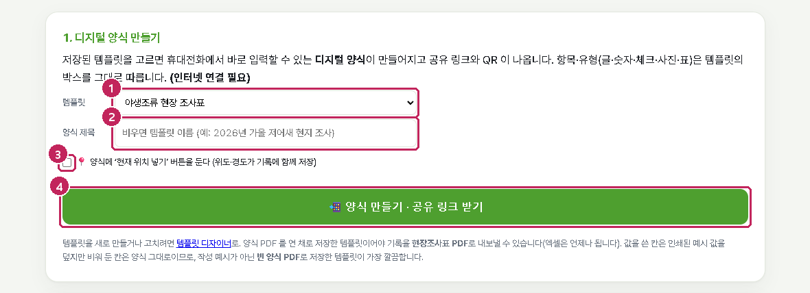

{{1}} 템플릿 — 저장된 템플릿 중 하나를 고릅니다. 항목·유형은 템플릿의 박스를 그대로 따릅니다
{{2}} 양식 제목 — 비우면 템플릿 이름. 조사 이름·시기를 적어 두면 여러 양식을 구분하기 좋습니다
{{3}} 현재 위치(GPS) 넣기 버튼을 둘지 — 켜면 기록에 위도·경도가 함께 저장됩니다
{{4}} 양식 만들기 · 공유 링크 받기 — 인터넷이 연결되어 있어야 합니다

1. 템플릿을 고르고 제목을 적은 뒤 **📲 양식 만들기 · 공유 링크 받기**를 누릅니다.
2. 몇 초 뒤 2번에 만든 양식이 나타나고 공유 링크·QR 이 보입니다.

> **알아두기** 양식 PDF 를 연 채로 저장한 템플릿이어야 기록을 현장조사표 PDF 로 내보낼 수 있습니다(엑셀은 언제나 됩니다). 값을 쓴 칸은 인쇄된 예시 값을 덮지만 비워 둔 칸은 양식 그대로이므로, 작성 예시가 아닌 **빈 양식 PDF** 로 저장한 템플릿이 가장 깔끔합니다.

### 5.2 공유 링크와 QR

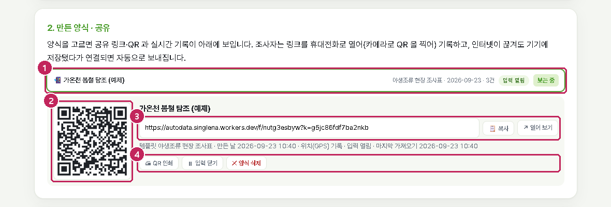

{{1}} 만든 양식 목록 — 제목·템플릿·만든 날·받은 기록 수·입력 열림/닫힘. **선택**을 누르면 아래에 상세가 열립니다
{{2}} QR — 휴대전화 카메라로 찍으면 입력 화면이 열립니다. **🖨 QR 인쇄**로 종이에 뽑아 현장에 붙여 두어도 됩니다
{{3}} 공유 링크 — **📋 복사**해서 메신저·문자로 보내거나, **↗ 열어 보기**로 이 컴퓨터에서 확인합니다
{{4}} 입력 닫기 · 양식 삭제

- 링크에는 **입력 키**가 들어 있습니다. 링크를 아는 사람은 기록을 보낼 수 있지만, 모인 기록을 볼 수는 없습니다.
- 기록을 가져오는 **관리 키**는 양식을 만든 컴퓨터에만 있습니다(`data\forms.json`). 다른 컴퓨터에서는 같은 양식의 기록을 가져올 수 없으니, 담당자 컴퓨터를 하나 정해 두세요.
- 조사가 끝나면 **⏸ 입력 닫기**를 누르세요. 링크를 열어도 더 보낼 수 없고, **▶ 입력 다시 열기**로 되돌릴 수 있습니다.

### 5.3 휴대전화 입력 화면

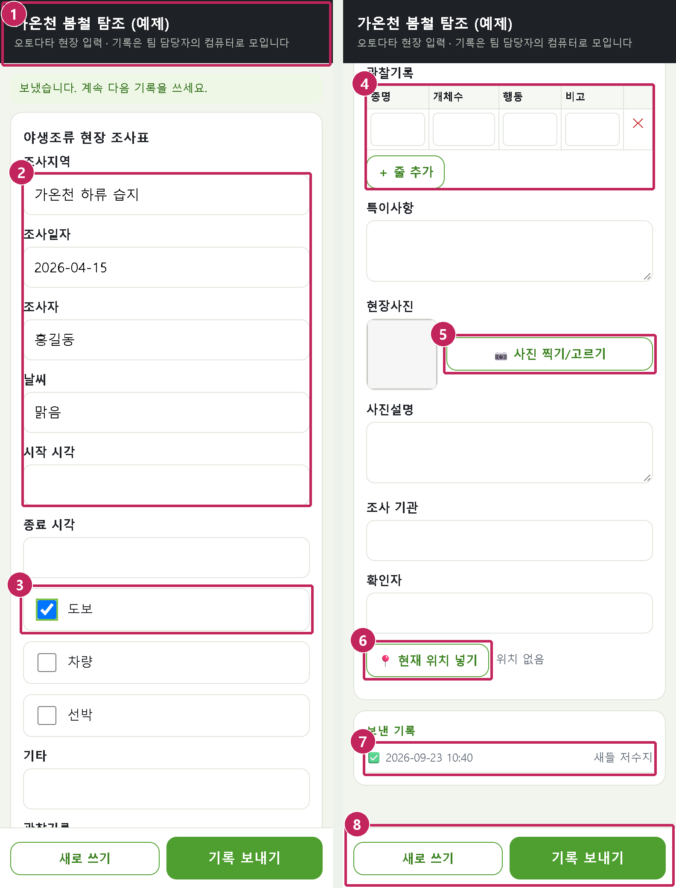

{{1}} 양식 제목 — 기록은 담당자의 컴퓨터로 모인다는 안내가 붙어 있습니다
{{2}} 입력 칸 — 템플릿의 박스 순서대로. 숫자 유형은 숫자 자판이 뜹니다
{{3}} 체크 항목
{{4}} 표(여러 행) — **＋ 줄 추가**로 줄을 늘리고 ✕ 로 지웁니다. 빈 줄은 보내지 않습니다
{{5}} 사진 찍기·고르기 — 카메라로 찍거나 앨범에서 고릅니다. 기기에서 줄여서(긴 변 1280픽셀) 보냅니다
{{6}} 현재 위치 넣기 — 양식을 만들 때 켠 경우에만 있습니다. 누르면 위도·경도가 기록에 붙습니다
{{7}} 보낸 기록 — 이 기기에서 보낸 기록의 시각과 첫 항목. ⏳ 은 인터넷이 없어 기기에 저장된 채 기다리는 기록
{{8}} 새로 쓰기 · 기록 보내기

- 설치할 앱이 없습니다. 휴대전화의 브라우저(크롬·사파리 등)에서 링크를 열면 됩니다.
- **인터넷이 끊겨도** 기록 보내기를 누를 수 있습니다. 기기에 저장됐다가 연결되면 자동으로 보내지고, 보낸 기록 목록의 ⏳ 가 ✅ 로 바뀝니다.
- 한 기록을 보내면 빈 양식이 다시 열려 다음 기록을 이어서 씁니다.
- 사진은 기록마다 최대 8장, 한 장 1.5MB 까지입니다.

### 5.4 실시간 기록

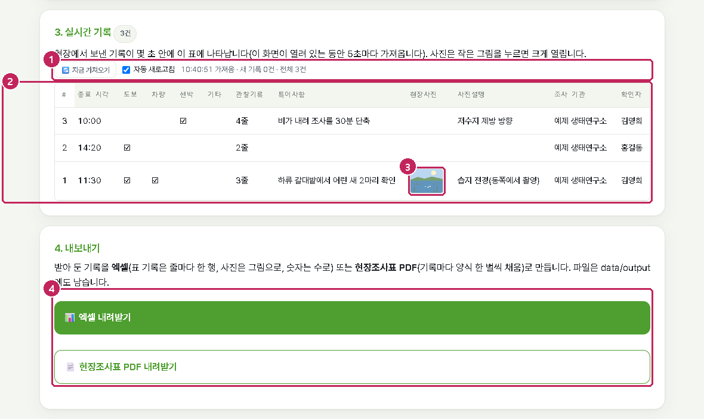

{{1}} 지금 가져오기 · 자동 새로고침 · 마지막으로 가져온 시각과 새 기록 수
{{2}} 기록 표 — 번호, 기록 시각(이 컴퓨터 시간), 위치, 항목별 값. 최근 기록이 위에 옵니다
{{3}} 사진 — 작은 그림을 누르면 크게 열립니다
{{4}} 내보내기 — 엑셀, 현장조사표 PDF

- 이 화면이 열려 있는 동안 5초마다 새 기록을 가져옵니다. 화면을 닫아 두었다가 다시 열면 그동안의 기록을 한꺼번에 가져옵니다.
- 가져온 기록은 이 컴퓨터의 `data\forms\<양식>\` 에 쌓입니다(사진 포함). 웹에는 양식을 지울 때까지 남아 있으므로 컴퓨터를 바꾸기 전에 내보내 두세요.
- 표 항목은 줄 수만 보이고, 값에 마우스를 올리면 내용이 보입니다.

### 5.5 입력 닫기 · 다시 열기 · 삭제

| 버튼 | 하는 일 |
|---|---|
| ⏸ 입력 닫기 | 조사자가 더 보낼 수 없게 합니다. 링크를 열면 "입력이 닫힌 양식입니다"가 보입니다. 이미 받은 기록은 그대로입니다 |
| ▶ 입력 다시 열기 | 닫은 양식을 다시 받게 합니다 |
| ✕ 양식 삭제 | 웹에 모인 양식·기록·사진과 이 컴퓨터의 보관 폴더를 모두 지웁니다. 내보낸 엑셀·PDF 는 `data\output` 에 남습니다. 되살릴 수 없으니 먼저 내보내세요 |

### 5.6 엑셀과 현장조사표 PDF 로 내보내기

**📊 엑셀 내려받기** — 데이터 추출 관리의 엑셀과 같은 규칙입니다.

| 열 | 값 |
|---|---|
| 기록 | `기록 1`, `기록 2` … (받은 순서) |
| 기록일시 | 조사자가 보낸 시각(이 컴퓨터 시간) |
| 위도 · 경도 · 위치오차m | 현재 위치 넣기를 켠 양식만. 수로 들어갑니다 |
| 일반·굵게 | 적은 글 그대로 |
| 숫자 | 수(합계·평균이 됨) |
| 체크 | 체크했으면 항목 이름(예: `도보`), 아니면 빈칸 |
| 표(여러 행) | 줄마다 한 행. 표 밖의 값(조사지역 등)은 줄마다 반복됩니다 |
| 이미지 | 그림으로 삽입(표 줄이 여럿이면 첫 행에만) |

**📄 현장조사표 PDF 내려받기** — 기록마다 양식 한 벌씩 값을 채운 PDF 한 파일입니다. 종이 조사표 철에 함께 두거나 결재 자료로 씁니다.

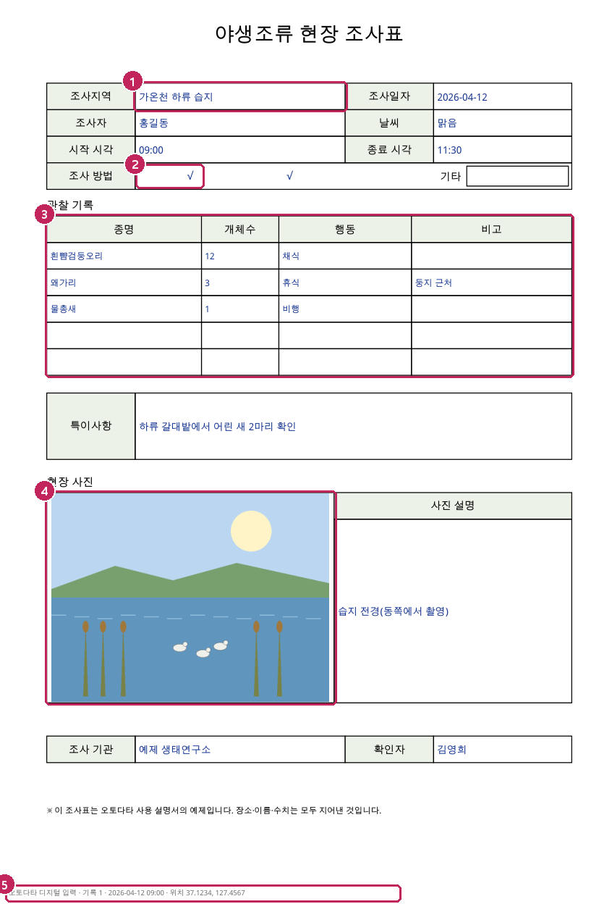

{{1}} 글·숫자 — 칸 크기에 맞춰 글자 크기를 줄여 넣습니다(진한 파랑)
{{2}} 체크 — 인쇄된 네모 위에 √
{{3}} 표(여러 행) — 양식의 줄에 차례로. 줄이 모자라면 남는 기록은 표 아래 작은 글씨로
{{4}} 사진 — 칸 비율에 맞춰 축소
{{5}} 바닥글 — 기록 번호·시각·위치

### 5.7 어디에 저장되나 · 보안

| 무엇 | 어디에 | 누가 볼 수 있나 |
|---|---|---|
| 양식 정의(항목 이름·유형) | 오토다타 웹(클라우드플레어) | 링크(입력 키)를 아는 사람 |
| 현장 기록·사진 | 오토다타 웹 → 가져오면 이 컴퓨터 `data\forms\` | 웹에서는 관리 키가 있는 담당자 컴퓨터만 |
| 입력 키·관리 키·양식 목록 | 이 컴퓨터 `data\forms.json` | 이 컴퓨터 사용자 |
| 내보낸 엑셀·PDF | 이 컴퓨터 `data\output\` | 이 컴퓨터 사용자 |

- 웹에는 양식을 지울 때까지 기록이 남습니다. 조사가 끝나면 내보낸 뒤 **양식 삭제**로 정리하세요.
- 기관 서버를 따로 두려면 도우미 폴더(`FieldSurveyDB.exe` 옆)에 `forms_config.txt` 를 만들고 `ORIGIN=https://주소` 를 적습니다. 서버에 양식 만들기 키를 두었다면 `PUBLISH_KEY=키` 를 한 줄 더 적습니다. 서버 설치 방법은 소스의 `web/README.md` 에 있습니다.

## 6. 데이터 추출 관리 — 작성된 조사표에서 엑셀 만들기 {#extract}

이미 작성된 조사표 파일들을 한꺼번에 올리면 저장된 템플릿으로 양식을 알아보고 값을 읽어 엑셀로 정리합니다. 한글(hwpx·hwp)·PDF·스캔 PDF 모두 되고, 한 파일에 조사표가 여러 장 이어져 있어도 됩니다.

### 6.1 파일 올리기

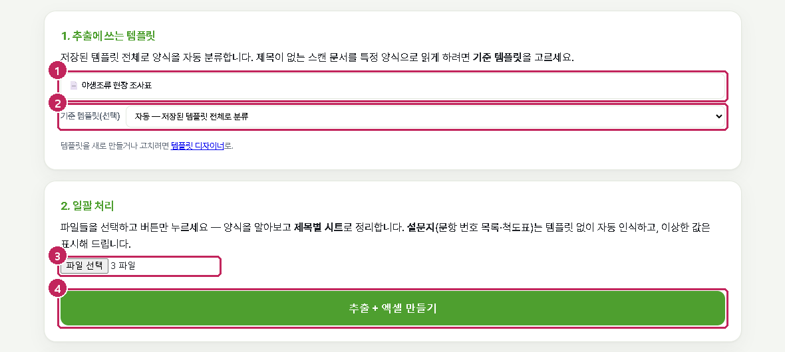

{{1}} 추출에 쓰는 템플릿 — 저장된 템플릿 전체로 양식을 자동 분류합니다
{{2}} 기준 템플릿(선택) — 제목이 없는 양식이나 스캔 문서를 특정 템플릿으로 읽게 할 때 고릅니다
{{3}} 파일 선택 — 여러 파일을 한꺼번에(Ctrl 로 여러 개 선택)
{{4}} 추출 + 엑셀 만들기

1. 2번의 **파일 선택**에서 조사표 파일들을 고릅니다.
2. **추출 + 엑셀 만들기**를 누릅니다. 한글 파일은 변환을 거치고, 스캔 문서는 글자 인식을 거치므로 파일 수와 쪽수에 따라 몇 초에서 몇 분 걸립니다. 진행 상황이 화면에 보입니다.

### 6.2 양식 자동 분류

- 쪽마다 제목(큰 글씨)과 라벨 배치를 저장된 템플릿과 견주어 어느 양식인지 정합니다. 맞는 템플릿이 없는 쪽은 **버림**으로 표시되고, 결과 아래의 **버려진 페이지 확인**에서 어느 양식으로 다시 처리할지 정할 수 있습니다.
- 제목 표기가 "1차"·"2차"처럼 조금씩 달라도 같은 양식으로 봅니다. 스캔 문서의 제목 오탈자도 비슷한 시트에 합칩니다.
- 같은 양식이 여러 이름의 템플릿으로 저장되어 있으면 **화면(템플릿 디자이너)에 불러온 것 → 가장 최근 저장본** 순으로 씁니다.
- **기준 템플릿**을 고르면 제목이 없는 쪽과 스캔 문서를 그 템플릿으로 읽습니다.

### 6.3 결과 확인

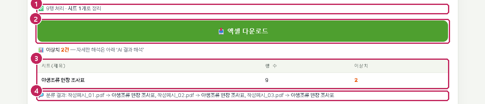

{{1}} 처리 결과 — 행 수와 시트 수, 미분류·실패 파일
{{2}} 엑셀 다운로드 — 결과 파일은 `data\output\조사데이터_추출_날짜.xlsx` 에도 남습니다
{{3}} 시트별 행 수와 이상치 수
{{4}} 분류 결과 — 파일마다 어느 템플릿으로 읽었는지

- **이상치**는 다른 행과 동떨어진 값(단위 착오, 오독 의심)에 붙는 확인 표시입니다. 엑셀에서 주황 칸과 메모로 보입니다. 값이 맞으면 그대로 두면 됩니다.
- 조사표에 값이 있는데 빈칸으로 나오면 스캔 문서의 글자 인식이 준비되지 않았거나(6.7절), 박스가 칸을 벗어난 경우입니다. 템플릿 디자이너에서 박스를 확인하세요.
- **대상지별 시트 이름**을 고르면 파일(묶음)마다 그 값(예: 하천명)으로 시트가 만들어집니다.

### 6.4 결과 엑셀의 구성

| 시트 | 내용 |
|---|---|
| 양식 이름(제목)마다 한 시트 | 첫 열 파일명, 그 뒤로 템플릿의 박스 순서대로 열. 조사표 한 장 = 한 행(표가 있으면 줄마다 한 행) |
| 대상지별 시트(고른 경우) | 대상지마다 항목·값 세로표 |
| 보고서 시트(보고서 양식을 올린 경우) | 6.8절 |

값 규칙(숫자·체크·표·이미지)은 5.6절의 표와 같습니다. 세로로 합쳐진 칸의 값은 걸친 행마다 반복되고, 줄바꿈으로 끊긴 이메일은 한 주소로 이어 붙입니다.

### 6.5 한 파일에 조사표가 여러 장일 때

한 파일 안에 조사표가 여러 묶음 들어 있으면(같은 양식이 반복되거나 양식 1·2·어도·사진 순서로 이어짐) 자동으로 나누어 묶음마다 한 행(또는 표의 줄마다 한 행)이 됩니다. 결과의 "분류 결과"에 `파일명 → 템플릿 ×묶음 수`로 표시됩니다.

### 6.6 설문지 — 템플릿 없이

표 없이 `1. 2. 3.` 문항 번호로 된 설문지와 문항 × 점수(1점~5점) 척도표는 템플릿 없이 자동 인식됩니다.

- 문항마다 열 하나. 선택한 답은 `번호:내용`(복수응답은 `;` 로 연결), 주관식은 글 그대로.
- 척도표의 열 이름은 `문항01, 문항02…`, 값은 점수.
- 스캔본에 손으로 친 동그라미·체크·사선은 잉크를 비교해 판정하고, 흐리거나 애매한 표시는 주황 칸 + 메모로 "확인 필요"를 알립니다.

### 6.7 스캔·사진 문서 — 글자 인식

글자 레이어가 없는 스캔·사진 PDF 는 글자 인식(OCR)을 거쳐 처리합니다.

- **경량판**은 처음 스캔 문서를 만나면 결과에 "글자 인식 기능이 없어 읽지 못한 쪽"과 **받기** 안내가 나옵니다. 받기(약 270MB, NVIDIA 그래픽카드가 있으면 GPU 가속판 약 2GB)를 누르면 공개 저장소에서 받아 이 컴퓨터에만 둡니다. 환경설정에서 미리 받아 둘 수도 있습니다(8.4절).
- **오프라인판·GPU판**은 바로 됩니다. 켠 뒤 처음 스캔 문서를 처리할 때 모델을 읽어 오느라 수십 초 걸립니다.
- CPU 로는 쪽당 약 10초, GPU 가속이면 1~2초입니다.
- 스캔 문서도 표 칸을 그림에서 찾아 칸 기준으로 읽으므로 줄이 늘거나 위치가 밀려도 값이 맞습니다. 손글씨는 또박또박 쓴 글씨일수록 인식률이 높습니다.
- 늘 똑같이 틀리게 읽히는 글자는 환경설정의 **스캔 글자 교정 사전**에 적어 두면 바로잡습니다(8.4절). 가락지 번호(`TOO`→`T00`), 양식 라벨과 한 글자만 다른 낱말은 자동으로 고칩니다.

### 6.8 보고서 출력 양식(선택)

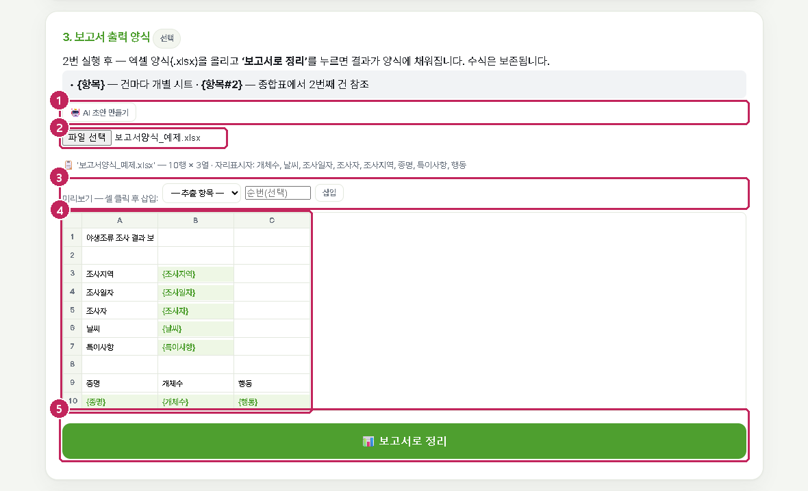

{{1}} 🤖 AI 초안 만들기 — 추출 항목을 보고 AI 가 보고서 양식 초안(xlsx)을 만들어 줍니다(AI 키 필요)
{{2}} 양식(.xlsx) 올리기
{{3}} 미리보기 도구 — 셀을 누르고 추출 항목과 순번을 골라 **삽입**하면 자리표시자가 들어갑니다
{{4}} 미리보기 — 양식의 셀과 자리표시자
{{5}} 📊 보고서로 정리 — 추출 결과를 양식대로 채운 엑셀을 만듭니다

엑셀 양식의 셀에 `{항목명}` 을 적어 두면 추출 결과가 그 자리에 채워집니다.

| 자리표시자 | 뜻 |
|---|---|
| `{조사지역}` | 조사표(건)마다 개별 시트를 만들고 그 건의 값을 채웁니다 |
| `{조사지역#2}` | 종합표에서 2번째 건의 값을 참조합니다(한 시트에서 여러 건) |

수식은 보존됩니다. 2번(일괄 처리)을 실행한 뒤에 쓸 수 있습니다.

### 6.9 AI 결과 해석(선택)

4번 **📊 AI로 결과 해석하기**를 누르면 추출 결과 표를 AI 가 요약·해석합니다(추세, 눈에 띄는 값, 빠진 값). 이때 결과 표의 내용이 AI 로 전송됩니다. 환경설정에 AI 키가 필요합니다.

### 6.10 SCE(수생태계 종적 연속성 평가) 연계(선택)

환경설정에서 SCE 연계를 켜면 추출 결과 아래에 **📋 SCE 입력양식 내보내기**와 **📈 SCE 평가까지 실행** 버튼이 생깁니다. 인공구조물·어류 현장조사표에서 읽은 값을 SCE 입력 양식 엑셀로 만들거나, SCE 가 설치되어 있으면 평가 결과(보고서·엑셀)까지 한 번에 만듭니다.

## 7. AI 데이터 추출·분석 {#ai}

템플릿이 없어도 파일을 넣으면 AI(Vision)가 쪽을 읽고 서식을 판별해 표로 만듭니다. 양식이 제각각이거나 템플릿을 만들 시간이 없을 때 씁니다. 환경설정에 AI 키가 있어야 하며, 넣은 파일의 내용이 선택한 AI 회사로 전송됩니다.

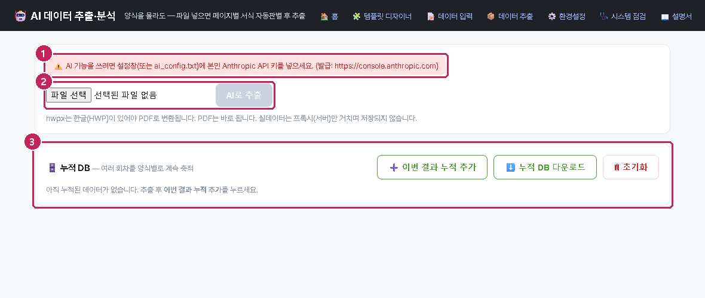

{{1}} AI 상태 — 키가 없으면 "AI 사용 불가"와 이유가 보입니다
{{2}} 파일 선택 · AI로 추출
{{3}} 누적 DB — 여러 회차의 결과를 양식별로 계속 쌓아 한 파일로 받습니다

1. 환경설정(8장)에서 AI 제공자와 키를 넣고 연결 테스트를 합니다.
2. 파일을 고르고 **AI로 추출**을 누릅니다. 쪽수에 따라 수십 초 걸립니다.
3. 결과는 쪽마다 카드로 보입니다. 노란 칸은 빈값, 빨간 칸은 형식 의심, 주황 칸은 이상치입니다. 값을 고치면 자동으로 저장되어 엑셀에 반영됩니다.
4. **엑셀 다운로드**로 받거나, **📊 데이터 분석(AI)**으로 결과를 해석합니다.
5. 회차마다 **➕ 이번 결과 누적 추가**를 누르면 누적 DB 에 쌓이고 **⬇️ 누적 DB 다운로드**로 한 파일이 됩니다.

> **주의** AI 가 읽은 값은 검수가 필요합니다. 특히 손글씨·흐린 스캔의 숫자는 반드시 원본과 대조하세요.

## 8. 환경설정 {#settings}

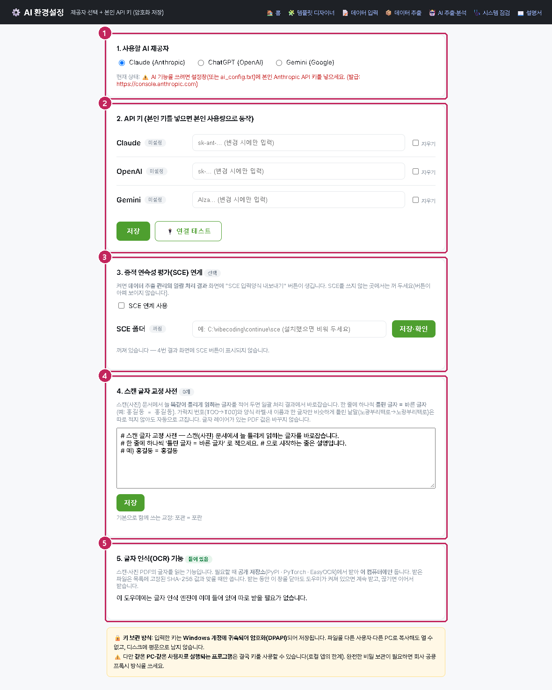

{{1}} 사용할 AI 제공자 — Claude · ChatGPT · Gemini 중 하나
{{2}} API 키 — 본인 키를 넣으면 본인 사용량으로 동작합니다. 저장·연결 테스트
{{3}} SCE 연계(선택)
{{4}} 스캔 글자 교정 사전
{{5}} 글자 인식(OCR) 기능 — 받기·지우기·GPU 가속판

### 8.1 AI 제공자와 키

- 키는 Windows 사용자 계정으로 **암호화 저장**됩니다(`ai_settings.enc`). 다른 사용자·다른 컴퓨터에서는 풀 수 없습니다.
- 키 칸은 바꿀 때만 적습니다. 비워 두고 저장하면 기존 키가 유지되고, **지우기**를 체크하면 지워집니다.
- **🔌 연결 테스트**는 선택한 제공자에 짧은 호출을 한 번 해 봅니다.
- 여러 컴퓨터에 같은 키를 배포하려면 `FieldSurveyDB.exe` 옆에 `ai_config.txt` 를 두고 `ANTHROPIC_API_KEY=키` 처럼 적어도 됩니다(평문이므로 배포 폴더 관리에 주의).

### 8.2 SCE 연계

수생태계 종적 연속성 평가 프로그램(SCE)이 설치된 컴퓨터에서 켭니다. 폴더를 비워 두면 설치된 SCE 를 찾고, 다른 곳에 있으면 폴더를 적고 **저장·확인**을 누릅니다. 켠 경우에만 데이터 추출 관리 결과에 SCE 버튼이 보입니다.

### 8.3 스캔 글자 교정 사전

스캔 문서에서 늘 똑같이 틀리게 읽히는 글자를 한 줄에 하나씩 `틀린 글자 = 바른 글자` 로 적습니다(예: `홍길둥 = 홍길동`). 다음 일괄 처리부터 반영되며, 글자 레이어가 있는 PDF 값은 바꾸지 않습니다.

### 8.4 글자 인식(OCR) 기능

| 상태 | 뜻 |
|---|---|
| 필요할 때 내려받기 | 경량판이고 아직 받지 않음. **CPU판 받기**(약 270MB) 또는 **GPU 가속판 받기**(약 2GB, NVIDIA 드라이버 580 이상) |
| 준비됨 · CPU / GPU | 받아서 쓸 수 있음. 지우기 가능 |
| 내장 | 오프라인판·GPU판 — 프로그램에 들어 있음 |

- 공개 저장소(PyPI · PyTorch · EasyOCR)에서 받아 사용자 폴더(`%LOCALAPPDATA%\AutoData\ocr`)에 둡니다. 받은 파일은 고정된 SHA-256 값과 맞을 때만 씁니다.
- 받는 동안 이 창을 닫아도 도우미가 켜져 있으면 계속 받고, 끊기면 이어서 받습니다. 방화벽이 막으면 오프라인판을 쓰세요.
- 새 버전 도우미를 받아도 다시 받지 않습니다.

## 9. 시스템 점검 {#syscheck}

새 컴퓨터에 처음 설치했을 때, 그리고 무언가 안 될 때 먼저 봅니다.

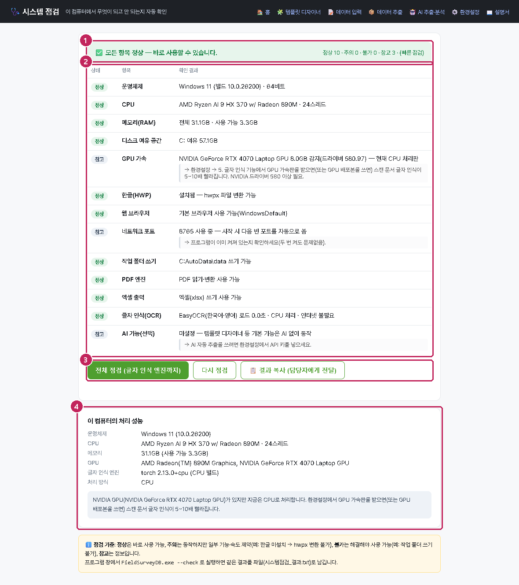

{{1}} 종합 판정 — 정상·주의·불가 개수
{{2}} 항목별 결과 — 문제가 있으면 해결 방법이 그 줄에 나옵니다
{{3}} 전체 점검(글자 인식 엔진까지) · 다시 점검 · 📋 결과 복사(담당자에게 전달)
{{4}} 이 컴퓨터의 처리 성능 — CPU·메모리·GPU 와 글자 인식 처리 방식

| 표시 | 뜻 |
|---|---|
| {정상} | 바로 사용 가능 |
| {주의} | 동작하지만 일부 기능·속도 제약(예: 한글 없음 → hwpx 변환 불가, GPU 없음 → CPU 처리) |
| {불가} | 해결해야 사용 가능(예: 작업 폴더에 쓸 수 없음). 해결 방법이 함께 표시됩니다 |
| {참고} | 정보 |

| 항목 | 정상 기준 | 문제 시 |
|---|---|---|
| 운영체제 · CPU · 메모리 · 디스크 | Windows 64비트, 4스레드, 8GB, 여유 2GB 이상 | 미달이면 동작은 하나 스캔 처리가 느림. `data` 의 오래된 결과 정리 |
| GPU 가속 | 정보 | NVIDIA 그래픽카드가 있는데 CPU 처리면 환경설정에서 GPU 가속판 받기. "CUDA 실패"면 드라이버를 580 이상으로 |
| 한글(HWP) | 설치됨 | hwpx 변환에만 필요. 없으면 한글에서 PDF 로 저장 후 PDF 사용 |
| 웹 브라우저 · 포트 | 기본 브라우저 있음, 8765 사용 가능 | 포트가 사용 중이면 자동으로 다음 포트 사용(정상) |
| 작업 폴더 쓰기 | `data` 쓰기 가능 | 폴더를 문서·바탕화면 등으로 이동 |
| PDF 엔진 · 엑셀 출력 · 글자 인식 | 사용 가능 | 불가면 zip 이 덜 풀린 것 — 다시 풀기. 글자 인식은 8.4절 |
| AI 설정 | 정보 | 7장·8장 |

명령창에서 `FieldSurveyDB.exe --check` 로 실행하면 같은 결과를 파일(`시스템점검_결과.txt`)로 남깁니다.

## 10. 자주 묻는 질문 {#faq}

### 실행 파일을 눌렀는데 아무 화면도 안 뜹니다

까만 창이 잠깐 떴다 사라지면 압축이 덜 풀렸거나 쓸 수 없는 폴더에 있는 것입니다. 다른 폴더(문서 등)에 다시 풀어 보세요. 까만 창은 떠 있는데 브라우저가 안 열리면 브라우저에서 `http://127.0.0.1:8765` 를 직접 여세요(까만 창의 "주소" 줄에 실제 포트가 있습니다).

### 웹 시작 페이지가 도우미를 찾지 못합니다

크롬·엣지는 인터넷 주소의 페이지가 이 컴퓨터(127.0.0.1)에 연결할 때 **로컬 네트워크 접근** 허용을 한 번 묻습니다. 허용한 뒤 **다시 찾기**를 누르세요. 도우미가 켜져 있는지(까만 창)도 확인하세요.

### 한글 파일 변환이 오래 걸리거나 멈춥니다

한글의 자동화 보안 승인 창이 뒤에 숨어 있을 수 있습니다. 가장 확실한 방법은 그 파일을 한글에서 **PDF로 저장**한 뒤 PDF 를 올리는 것입니다(결과 동일).

### 스캔 조사표를 올렸는데 빈 행만 나옵니다

경량판에서 글자 인식 기능을 아직 받지 않은 경우입니다. 결과의 **받기** 안내나 환경설정 → 글자 인식 기능에서 받으세요(6.7절). 받은 뒤 다시 처리하면 됩니다.

### 이미지(사진) 칸이 추출되지 않습니다

같은 양식의 템플릿이 여러 이름으로 저장되어 예전 것이 쓰인 경우가 많습니다. 템플릿 디자이너의 저장된 템플릿 목록에서 예전 것을 지우거나, 데이터 추출 관리에서 **기준 템플릿**을 고르세요.

### 값이 옆 칸 글자와 섞여 나옵니다

박스가 칸을 벗어난 경우입니다. 템플릿 디자이너에서 그 박스를 칸 안으로 줄이고 다시 저장하세요. 라벨 기준 박스는 라벨을 못 찾을 때만 좌표를 쓰므로, 라벨이 맞는지도 확인합니다.

### 숫자가 글자로 들어갑니다

박스 유형이 **숫자**가 아닙니다. 항목 목록에서 유형을 숫자로 바꾸면 단위를 걷어내고 수로 넣습니다. 값 일부만 숫자면(`좌안 12 우안 15`) 정보가 잘리지 않도록 글자 그대로 둡니다.

### 양식 만들기가 안 됩니다 — "연결할 수 없습니다"

데이터 입력 관리는 인터넷이 있어야 합니다. 연결을 확인하세요. 기관 방화벽이 `autodata.singlena.workers.dev` 를 막으면 담당자에게 허용을 요청하거나 5.7절처럼 기관 서버를 두세요.

### 휴대전화에서 "링크의 키가 맞지 않습니다"가 나옵니다

링크가 잘려서 전달된 경우입니다(뒤의 `?k=…` 까지 전체가 링크입니다). QR 을 다시 찍거나 링크를 다시 복사해 보내세요.

### 다른 컴퓨터에서 같은 양식의 기록을 가져오고 싶습니다

기록을 가져오는 관리 키는 양식을 만든 컴퓨터의 `data\forms.json` 에만 있습니다. 그 컴퓨터에서 내보낸 엑셀·PDF 를 공유하거나, `data\forms.json` 과 `data\forms\` 폴더를 새 컴퓨터의 같은 자리로 옮기세요(옮긴 뒤에는 한 컴퓨터에서만 쓰세요).

### 현장조사표 PDF 에 예시 값이 남아 있습니다

템플릿을 빈 양식이 아니라 작성된 조사표로 만들어 그 값이 양식 PDF 에 인쇄되어 있는 경우입니다. 값을 쓴 칸은 덮지만 비워 둔 칸은 양식 그대로입니다. 빈 양식 PDF 로 템플릿을 다시 저장하고 양식을 새로 만드세요.

### AI 버튼이 "설정 필요"입니다

환경설정에서 제공자를 고르고 키를 저장한 뒤 연결 테스트를 하세요. 키가 있어도 잔액·권한 문제면 테스트 결과에 이유가 나옵니다.

### 창을 두 번 켰습니다

괜찮습니다. 두 번째 도우미는 자동으로 다음 포트(8766…)에서 뜹니다. 웹 시작 페이지는 먼저 찾은 도우미로 연결합니다.

## 11. 부록 {#appendix}

### 11.1 파일과 폴더

모두 `FieldSurveyDB.exe` 옆 `data` 폴더 안에 있습니다. 이 폴더만 옮기면 새 버전에서도 그대로 이어집니다.

| 위치 | 내용 |
|---|---|
| `data\templates.json` · `data\template_pdfs\` | 템플릿(박스 목록)과 함께 저장한 양식 PDF |
| `data\forms.json` · `data\forms\<양식>\` | 디지털 양식 목록(입력 키·관리 키)과 가져온 기록·사진 |
| `data\output\` | 결과 엑셀·현장조사표 PDF·보고서·누적 DB |
| `data\uploads\` · `data\pdf_cache\` | 처리 중 임시 파일(지워도 됨) |
| `ai_settings.enc` · `ai_config.txt` | AI 키(암호화) · 배포용 키 파일(선택) |
| `forms_config.txt` · `web_origins.txt` | 기관 서버 주소(선택) · 허용할 웹 시작 페이지 주소(선택) |
| `%LOCALAPPDATA%\AutoData\ocr` | 경량판이 받은 글자 인식 기능 |
| `예제\` | 3장의 예제 조사표 |

### 11.2 단축키 (템플릿 디자이너)

| 키 | 하는 일 |
|---|---|
| Ctrl + 클릭 · Shift + 클릭 | 박스 하나씩 더하기·빼기 · 범위 선택 |
| Shift + 빈 곳 끌기 | 영역 선택 |
| Ctrl + A | 이 쪽의 박스 전체 선택 |
| Delete | 선택한 박스 삭제 |
| Ctrl + Z | 되돌리기 |
| 빈 곳 끌기 | 새 박스 그리기 |

### 11.3 명령줄

| 명령 | 하는 일 |
|---|---|
| `FieldSurveyDB.exe` | 도우미 켜기(브라우저 자동 열림) |
| `FieldSurveyDB.exe --check` | 전체 시스템 점검 후 `시스템점검_결과.txt` 저장 |

### 11.4 용어

| 용어 | 뜻 |
|---|---|
| 도우미 | 이 컴퓨터에서 도는 오토다타 프로그램(`FieldSurveyDB.exe`). 브라우저 화면은 도우미가 보여 줍니다 |
| 템플릿 | 양식 하나의 읽을 자리(박스) 목록 + 양식 PDF |
| 박스 | 양식에서 값을 읽는 사각형 자리. 이름이 엑셀 열 이름 |
| 라벨(앵커) | 박스 옆의 항목 이름 칸. 라벨 기준 박스는 이 칸을 찾아 옆 칸을 읽습니다 |
| 디지털 양식 | 템플릿으로 만든 휴대전화 입력 페이지. 공유 링크·QR 로 엽니다 |
| 입력 키 · 관리 키 | 링크에 든 키(기록 보내기) · 담당자 컴퓨터에만 있는 키(기록 가져오기·닫기·삭제) |
| 이상치 | 다른 행과 동떨어진 값에 붙는 확인 표시(주황 칸) |
| 글자 인식(OCR) | 스캔·사진의 글자를 읽는 기능 |
